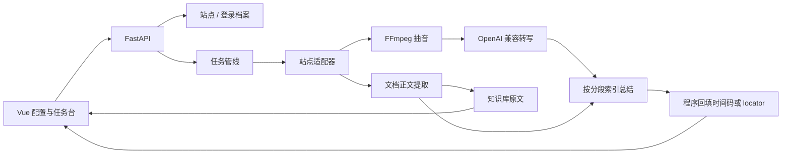

# 架构说明

## 分层

1. 接入层：`generic` / `xiaoe` / `yueniu` / `bilibili` 识别 URL。音视频提取或接收媒体地址；generic 下的普通网页和 PDF/Word 等走文档分支。B 站走公开稿件接口取 DASH 音轨。
2. 媒体层：FFmpeg 把文件或 HLS 抽成 16kHz 单声道 WAV。转写完成后同一份 WAV 会压成 opus 归档（`app/services/audio_store.py`，约 WAV 的十分之一），任务目录里只留归档；「重新转写」时先解回 WAV 再交给转写器，因此不依赖原始地址是否仍然有效。设置页「关于」可以查看归档占用并手动清理。播放时另会在任务目录缓存 `play.mp4`，缓存总量超上限时按「最久没播放」淘汰（`app/services/storage.py` 的 `enforce_play_quota`），上限存在设置表 `play_quota_mb` 里，为 0 表示不限制。
3. 文档层：`pymupdf` / `python-docx` / `trafilatura` 抽正文。扫描 PDF、旧版 `.doc` 为 `DATA_DIR/plugins` 里的按需插件（RapidOCR、LibreOffice）。
4. 转写层：兼容 `/v1/audio/transcriptions` 的 `verbose_json` 分段。文档把段落写成同样的 `TranscriptSegment`，带 `locator`。
5. 总结层：音视频默认总结；文档默认直接入库原文，勾选后才调用模型。模型只输出分段编号；`timeline.attach_timestamps` 映射秒数或页/段 locator。
6. 展示层：任务详情把章节、要点做成可点击定位；知识库基于本机转写和文档做检索增强对话，问答写入本地会话表，可搜索和删除。

默认 Docker 镜像只安装 FFmpeg 和 `libgomp1`，不装 Tesseract / LibreOffice。OCR 与旧版 `.doc` 在任务需要时（或设置页预装）下载到 `DATA_DIR/plugins`，容器重建后仍然保留。

容器同样看不到宿主机文件系统。要处理宿主机上的文件，把宿主机目录挂到容器（compose 变量 `VIDEO_SUMMARY_MEDIA` → `/media`，即 `MEDIA_DIR`）：`app/services/localfs.py` 会列出该根目录下的文件夹与受支持文件，界面在「本地任务」里多选或整目录加入，勾选后按容器内路径建任务，再交给 `generic` 适配器按本地媒体处理。浏览被限制在根目录内，容器只读挂载。

## 登录态打通

`AuthProfile` 保存一套 Cookie。`Site.domain_patterns` 决定哪些主机名使用该档案。小鹅通短链域与店铺域、约牛页面域与直播域都可以挂到同一档案，无需重复粘贴。

## 数据与索引

数据库是 `DATA_DIR` 下的 SQLite。新库由 `Base.metadata.create_all` 按模型建表；老库在启动时走 `app/database.py` 的 `migrate_job_columns()`：用 `PRAGMA table_info` 补齐缺的列，再用 `CREATE INDEX IF NOT EXISTS` 补建索引（`JOB_INDEXES`）。

`jobs` 上的索引都对应真实查询：`status`（任务列表按状态筛选）、`coalesce(source_created_at, created_at)` + `created_at` + `id`（任务列表默认按原片发布时间倒序、日期区间筛选：列顺序要和 SQL 里的 `ORDER BY` 完全对齐，否则 SQLite 会退回「扫表 + 临时排序」）、`created_at` + `id`、`updated_at`（知识库分页）、`domain_id` + `updated_at`（知识库按领域收窄）、`schedule_log_id`（定时汇总反查同批任务）。同一索引名定义变了会在启动时自动 `DROP` 重建，所以调整索引不需要手写数据迁移。加新的过滤或排序条件时，同步在 `JOB_INDEXES` 与 `Job.__table_args__` 两处补索引，别让查询退回全表扫描。

## 定时调度

后台线程在 `app/services/schedule.py`，时间规则存在 `schedule_rules.cron`（标准 5 段 cron：分 时 日 月 周），解析、中文解读与「下一次触发」由 `app/services/cron.py` 算，纯标准库实现，支持 `*`、区间、步进、列表和月份 / 星期的英文缩写，日与星期同时限定时取「或」（跟 cron 一致），`0` 与 `7` 都表示周日。老配置的 `cron` 为空时按 `time` 字段拼出等价的「每天 HH:MM」，所以升级不用动数据。所有判断都在北京时间（`sourcetime.SHANGHAI`）做，库里存 UTC。

是否该跑由 `missed_scheduled_run()` 决定：取「当前时刻（含）之前最近的一个触发点」，再看这个触发点之后（`started_at >= 触发点`）有没有跑完的日志。所以一天跑多次的配置每个触发点各跑一次，进程停机跨过的触发点在当天仍会补跑一次，日志里「已跳过」不算跑过。扫描内容的下限用 `run_scan_since()`：定时触发从上一次触发点算起（每周 / 每月这类低频配置不会漏内容），手动触发仍只看当天 0 点。

## 任务队列

转写集中在 `app/services/jobqueue.py` 的队伍里按先进先出跑：工作线程按上限（`MAX_WORKERS = 8`）起，同时真正跑几个由「并行路数」控制——本机转写（SenseVoice / faster-whisper / 没配 Key 或指向本机地址的接口，看 `transcribe.is_local_transcribe()`）固定 1 路，云端接口按设置页「并行转写数」（`transcribe_concurrency`，0 = 自动，取 `TRANSCRIBE_CONCURRENCY`，默认 3 路）。并行路数在启动（`jobqueue.configure()`）和保存设置（`PUT /api/settings` 改了转写模型 / Key / Base URL / 并行数时 `jobqueue.refresh_concurrency()`）两处重算。任务创建入口（`POST /api/jobs`、批量创建、`/api/jobs/digest`、定时批次）只负责把任务排进队列就返回，轮不到的任务停在 `stage=queued`（界面显示「排队中」），不会没限制地一起抢 CPU、把接口打到限流。本机转写还要跨进程排队：跑本机任务前会先拿一把 `fcntl.flock` 文件锁（`settings.transcribe_lock_path()`，默认数据目录下的 `transcribe.lock`，测试里由 `TRANSCRIBE_LOCK_FILE` 指到临时目录），同一台机器上哪怕活着两个后端进程（`--reload` 换代时旧子进程还在跑原生转写没退干净、或手动起了两个）也只有一个在真正转写，抢不到锁的那个排队等；云端按「并行转写数」并行，不受这把锁影响。

定时任务触发创建的那一批按任务逐个排队，汇总总结单独占队列里的一项（用 `depends_on` 指向这批任务），整批跑完才轮到它。

轮到某个任务时才由队列写 `started_at`（`stamp_job_start`），所以排队等待的时间不算进任务耗时（界面在 `stage=queued` 时同样不显示「已用时间」，任务列表也只显示「排队中」）；任务已经被取消或删掉时只跳过这一步，执行本身仍交给流水线按取消标记处理。排队中取消 / 删除会调用 `forget()` 把任务从队列摘掉（等它的汇总总结也一起放行，不会干等）；进程退出时没跑完的任务留在库里保持 `pending`，下次启动由 `requeue_pending()` 按创建时间重新排队；被强杀（`--reload` 换代 / 崩溃）来不及退干净的任务会留在 `running`，启动时由 `reclaim_running()` 认领：`Job.owner_pid` 记的是开始跑它的进程（`stamp_job_start()` 里写），那个进程已经没了（或就是本进程重启前的自己）才改回 `pending` 重新排队，别的进程还活着就不动它——那说明它真的还在跑。`settings.job_queue`（`JOB_QUEUE=0`）只为测试关掉这个线程——关掉后任务会一直停在「排队中」。

## 知识库检索

检索与问答都在进程内完成，没有向量库：`app/services/knowledge.py` 把每个任务切成标题 / 转写窗口 / 综述 / 章节 / 要点等切片，在「繁简归一化 + 小写」后的文本上做子串打分（整句命中 8 分，词命中 2.5 或 1.2 分），取分最高的若干条当依据。

贵的是归一化（`zhconv` 转换），不是匹配本身：本机 83 个任务、325 万字转写的真实库上，一次检索 0.39s 里有 0.32s 花在归一化，纯匹配只要 0.003s。所以 `chunk_index()` 把切片连同归一化文本缓存起来（`MAX_INDEX_JOBS` 为上限、最久未用淘汰、键是 `updated_at` + 正文长度 + 标题），首次检索照旧，之后同一任务的检索只做子串匹配：同库上从 0.39s 降到 0.01~0.02s。转写 / 综述 / 标题一变，缓存键就变，自动重建。

归一化统一走 `textnorm.match_key()`（繁简收敛 + 统一「幺/么」+ 小写）。两个坑都在 `zhconv` 上：它单趟转换不幂等（「為什麼」→「为什么」→「为什幺」），必须迭代到稳定，否则繁体提问「為什麼半年」匹配不到正文里的「为什么半年」；它的短语表还会把「么半」这类词误转成「幺半」（「那么半年」→「那幺半年」），写入路径因此按位把「么→幺」还原回去，检索键则把「幺/么」统一，老库里已经被写坏的文本不必清洗。

写入路径 `normalize_transcript()` = `apply_lexicon(to_simplified())`，转写与文档正文入库时就已经是简体；但 LLM 生成的综述 / 章节 / 要点、以及视频与网页标题没有这一步，检索侧的归一化同时给它们兜底（实测本机库里 `overview` 有 33/80 篇含非简体，转写窗口只有 1/11063）。

带关键词的搜索只对命中的任务构造 `KnowledgeDoc`（此前先把所有任务都建一遍文档再筛）；列表页不带关键词时仍走 SQL 分页（`updated_at` 索引），不加载全文。
