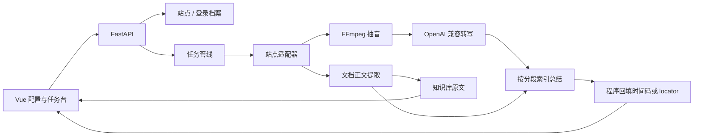

# 架构说明

## 分层

1. 接入层：`generic` / `xiaoe` / `yueniu` / `bilibili` 识别 URL。音视频提取或接收媒体地址；generic 下的普通网页和 PDF/Word 等走文档分支。B 站走公开稿件接口取 DASH 音轨。
2. 媒体层：FFmpeg 把文件或 HLS 抽成 16kHz 单声道 WAV。
3. 文档层：`pymupdf` / `python-docx` / `trafilatura` 抽正文。扫描 PDF、旧版 `.doc` 为 `DATA_DIR/plugins` 里的按需插件（RapidOCR、LibreOffice）。
4. 转写层：兼容 `/v1/audio/transcriptions` 的 `verbose_json` 分段。文档把段落写成同样的 `TranscriptSegment`，带 `locator`。
5. 总结层：音视频默认总结；文档默认直接入库原文，勾选后才调用模型。模型只输出分段编号；`timeline.attach_timestamps` 映射秒数或页/段 locator。
6. 展示层：任务详情把章节、要点做成可点击定位；知识库基于本机转写和文档做检索增强对话，问答写入本地会话表，可搜索和删除。

默认 Docker 镜像只安装 FFmpeg 和 `libgomp1`，不装 Tesseract / LibreOffice。OCR 与旧版 `.doc` 在任务需要时（或设置页预装）下载到 `DATA_DIR/plugins`，容器重建后仍然保留。

## 登录态打通

`AuthProfile` 保存一套 Cookie。`Site.domain_patterns` 决定哪些主机名使用该档案。小鹅通短链域与店铺域、约牛页面域与直播域都可以挂到同一档案，无需重复粘贴。
