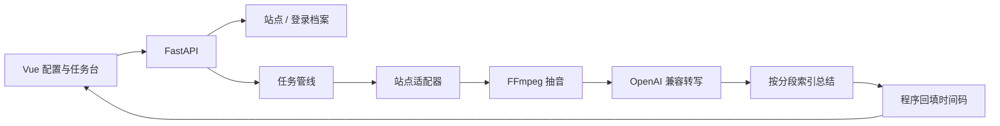

# 架构说明

## 分层

1. 接入层：`generic` / `xiaoe` / `yueniu` / `bilibili` 识别 URL，注入用户配置的 Cookie/Header，提取或接收媒体地址。B 站走公开稿件接口取 DASH 音轨。
2. 媒体层：FFmpeg 把文件或 HLS 抽成 16kHz 单声道 WAV。
3. 转写层：兼容 `/v1/audio/transcriptions` 的 `verbose_json` 分段。
4. 总结层：大模型只输出分段编号；`timeline.attach_timestamps` 映射真实秒数。
5. 展示层：任务详情把章节、要点、转写都做成可点击时间轴；知识库基于本机转写做检索增强对话。

## 登录态打通

`AuthProfile` 保存一套 Cookie。`Site.domain_patterns` 决定哪些主机名使用该档案。小鹅通短链域与店铺域、约牛页面域与直播域都可以挂到同一档案，无需重复粘贴。
